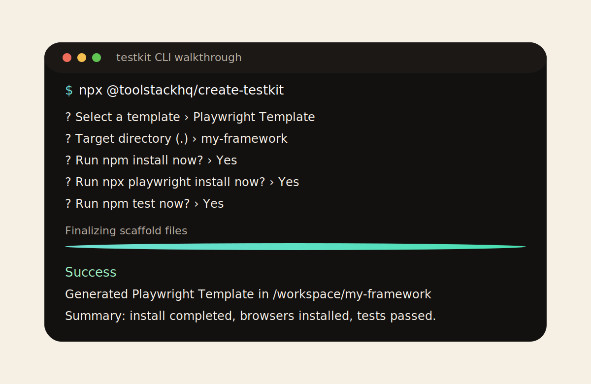

# testkit

[](https://github.com/toolstackhq/testkit/actions/workflows/playwright-tests.yml)
[](https://github.com/toolstackhq/testkit/actions/workflows/generated-template-validation.yml)
[](https://github.com/toolstackhq/testkit/actions/workflows/mcp-server.yml)
[](https://github.com/toolstackhq/testkit/actions/workflows/dependency-watch.yml)
[](https://toolstackhq.github.io/testkit/)
[](https://www.npmjs.com/package/@toolstackhq/create-testkit)
[](./package.json)

`testkit` is a project scaffolding tool for modern test automation frameworks.

Supported projects today:

- `Playwright`
- `Cypress`
- `WebdriverIO`

## Table of contents

- [Feature matrix](#feature-matrix)
- [Use as npm CLI](#use-as-npm-cli)
- [Use as MCP server](#use-as-mcp-server)
- [Detailed documentation](#detailed-documentation)
- [Contributing](#contributing)

## Feature matrix

| Feature                               | Playwright | Cypress | WebdriverIO |
| ------------------------------------- | ---------- | ------- | ----------- |
| TypeScript template                   | **✓**      | **✓**   | **✓**       |
| Built-in sample app for local testing | **✓**      | **✓**   | **✓**       |
| API example                           | **✓**      | **✓**   | **✓**       |
| Data factory                          | **✓**      | **✓**   | **✓**       |
| Page objects / page modules           | **✓**      | **✓**   | **✓**       |
| Multi-environment support             | **✓**      | **✓**   | **✓**       |
| Secret management pattern             | **✓**      | **✓**   | **✓**       |
| Linting checks                        | **✓**      | **✓**   | **✓**       |
| CI workflow                           | **✓**      | **✓**   | **✓**       |
| Optional Allure report                | **✓**      | **✓**   | **✓**       |
| Docker support                        | **✓**      | **✓**   | **✓**       |
| MCP scaffolding support               | **✓**      | **✓**   | **✓**       |
| AI-ready template guidance            | **✓**      | **✓**   | **✓**       |
| Safe template upgrade checks          | **✓**      | **✓**   | **✓**       |

## Use as npm CLI

[](https://toolstackhq.github.io/testkit/#cli)

Open the docs site for the live animated terminal walkthrough built with a Termynal-style interaction:

- [Animated CLI walkthrough](https://toolstackhq.github.io/testkit/#cli)

```bash
# Run the scaffolder
npx @toolstackhq/create-testkit
```

```bash
# Launch the local setup UI wrapper
npx @toolstackhq/create-testkit --ui
```

```text
? Select a template
? Target directory
? Run npm install now?
? Run npx playwright install now?   # Playwright only
? Run npm test now?
```

```bash
# Scaffold Playwright directly
npx @toolstackhq/create-testkit playwright-template my-project
```

```bash
# Scaffold Cypress directly
npx @toolstackhq/create-testkit cypress-template my-project
```

```bash
# Scaffold WebdriverIO directly
npx @toolstackhq/create-testkit wdio-template my-project
```

```bash
# Check for safe managed-template updates later
npx -y @toolstackhq/create-testkit upgrade check .
```

```bash
# Apply only safe managed-template updates
npx -y @toolstackhq/create-testkit upgrade apply --safe .
```

The local `--ui` flow is a browser wrapper over the same scaffold engine. It collects options visually, mirrors progress live, and still keeps the terminal as the primary execution surface.

## Use as MCP server

Use the MCP server when you want an LLM to scaffold projects deterministically instead of generating framework boilerplate from scratch.

Generated templates also include:

- `AI_CONTEXT.md` for any LLM
- `AGENTS.md` as a thin pointer for tools that look for agent instructions

That means the generated project already carries framework-specific guidance for adding tests, updating page objects, and maintaining CI without the model inventing its own structure.

<details>
<summary>Codex</summary>

Add this to your Codex MCP config:

```json
{
  "mcpServers": {
    "testkit": {
      "command": "npx",
      "args": ["-y", "@toolstackhq/testkit-mcp"]
    }
  }
}
```

Prompt example:

```text
Create a Playwright framework in /tmp/pw-demo without installing dependencies.
```

</details>

<details>
<summary>Claude Code</summary>

Anthropic documents Claude Code MCP servers in a project `.mcp.json` file. Reference: [Connect Claude Code to tools via MCP](https://docs.anthropic.com/en/docs/claude-code/mcp).

```json
{
  "mcpServers": {
    "testkit": {
      "command": "npx",
      "args": ["-y", "@toolstackhq/testkit-mcp"]
    }
  }
}
```

Prompt example:

```text
Describe the playwright-template and scaffold it in ./my-framework.
```

</details>

## Detailed documentation

- [Docs index](./docs/README.md)
- [MCP docs site](https://toolstackhq.github.io/testkit/)
- [Run locally](./docs/local-development.md)
- [Framework architecture](./docs/architecture.md)
- [Agent layer](./docs/agent-layer.md)
- [Write and extend tests](./docs/extending-the-repository.md)
- [Reporting](./docs/reporting.md)
- [CI and quality checks](./docs/ci-and-quality.md)
- [Security and secrets](./docs/security.md)
- [MCP server package](./packages/mcp-server/README.md)
- [Playwright template README](./templates/playwright-template/README.md)
- [Cypress template README](./templates/cypress-template/README.md)
- [WebdriverIO template README](./templates/wdio-template/README.md)

## Contributing

Open an issue or PR if you want to add:

- a new framework template
- shared upgrade logic
- new MCP tooling
- stronger CI or reporting patterns
